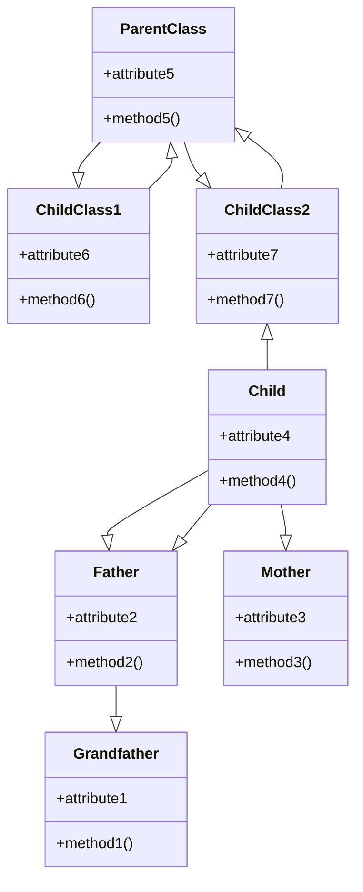

```mermaid
classDiagram
    class Grandfather {
        +attribute1
        +method1()
    }
    
    class Father {
        +attribute2
        +method2()
    }
    
    class Mother {
        +attribute3
        +method3()
    }
    
    class Child {
        +attribute4
        +method4()
    }
    
    class ParentClass {
        +attribute5
        +method5()
    }
    
    class ChildClass1 {
        +attribute6
        +method6()
    }
    
    class ChildClass2 {
        +attribute7
        +method7()
    }
    
    %% Single Inheritance
    Father --|> Grandfather
    
    %% Multilevel Inheritance
    Child --|> Father
    
    %% Hierarchical Inheritance
    ParentClass --|> ChildClass1
    ParentClass --|> ChildClass2
    
    %% Multiple Inheritance
    Child --|> Father
    Child --|> Mother
    
    %% Hybrid Inheritance
    ParentClass <|-- ChildClass1
    ParentClass <|-- ChildClass2
    ChildClass2 <|-- Child

    
    
```

