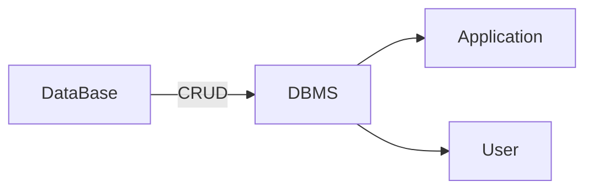

## DBMS (Database Management System)

A DBMS is the software that allows you to **store, manage, and access data**.
It acts as an interface between the **user, the application, and the hardware**.

in details 
people think data is stored in database . 
but actually database is taked to operating system.
- operating system is brige between hardware and software
- now data is stored in hardware memory (hdd,sddd)      

Functions of a DBMS:

* CRUD Operations (Manage Data)
* Maintain Integrity (Accuracy & Consistency)
* Handle Concurrency (Multiple Users)
* Provide Security & Backup
* Query Optimization (Performance)

