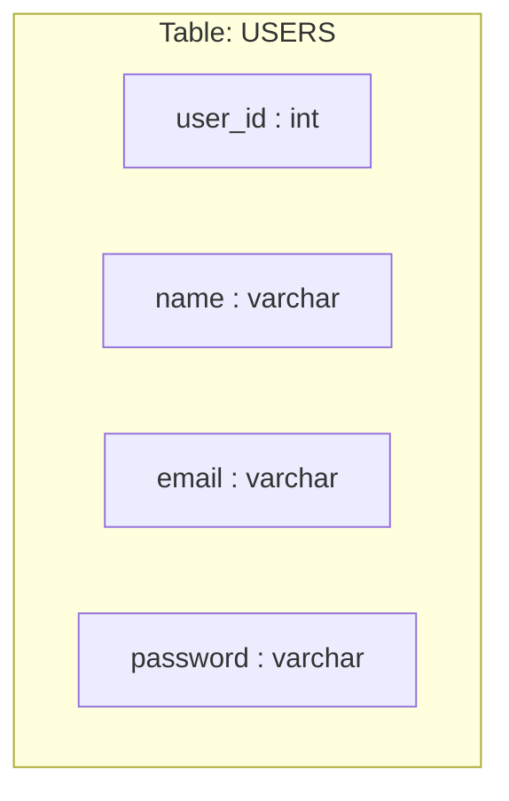

now we learn the 3 commands 
table create karna 
table delete karna 
table ko khali karna yadi uska andr koi data ha usko empty karna  0 data 

1. Create
2. Truncate
3. Drop

## create

create our database
```sql
CREATE DATABASE if NOT EXISTS campusx
```

jab bhi aap table banho ga apka dimag ma ek stucture hona chaya 
hum campusx ka users ka table banya ga . 
tho column name and usko data type
sql string ko varchar yani variable character bolta ha jism 256 aa sakta ha 
users - int
name -> varchar
email -> varchar
password -> varchar




```sql
CREATE TABLE TABLE_NAME(
		coloumn_name datatype
    	coloumn_name datatype
    	coloumn_name datatype
)
```


```sql
CREATE TABLE users()
```
 create the full table 
 ```sql
 CREATE TABLE users(
	  user_id INTEGER,
	  name VARCHAR(255),
	  email VARCHAR(255),
	  password VARCHAR(255) 
)
```

we add data using insert then

## truncate 
it removes all the rows in table. whatever data you stored
```sql
TRUNCATE TABLE users
```

it is very risky command 
iska soch samaj kar karna paryog


## drop 

```sql
DROP TABLE if EXISTS users
```


wow we learn the five things today 