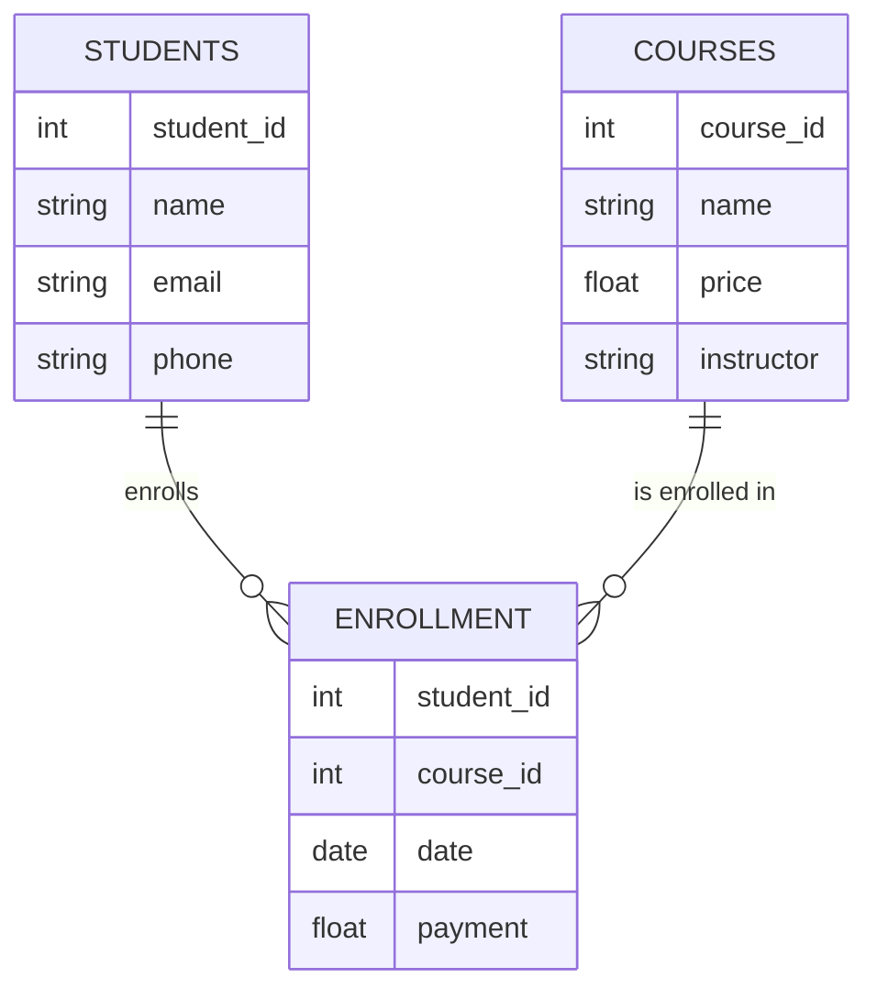

# Database keys.
a key in a database is an `attribuites` or a `set of attribuites` that uniquely identifies a tuple(row) in a table. 
- keys play a crucial role in ensuring the integrity and relaibaitlity of a databases by enforing unique constraint on the data 
- establishing relationship between tables . 

key ek asa  unique  single column or multiple column jinsa aap row ko uniquely define kar paw . 
jissa aap two rows ko different kar paho . usko ham key bolta ha        
Tho basically in future jab aap thoda complex database design karoga jaha par multiple table hoga aor vo apasa ma ek dursa ka sath connect hoga         
wa par apko keys help karta ha to understand the relationship. yadi apna keys ko pakad liya tho aap unka bitch ma relationship ko acha sa handle kar paho ga. otherwise gadbad ho sakta         
in short : keys are very important apka pata hona chaya keys kiya hota ha . un keys ka kiya use hota ha

Example : harma paas ya students ka roll no,name ,branch ,email ka information ha 

| Roll No | Name     | Branch | Email               |
|--------:|----------|--------|---------------------|
| 1       | Himanshu | CSE    | himanshu@gmail.com  |
| 2       | Manish   | EEE    | manish@gmail.com    |
| 3       | Tanish   | ME     | tanish@gmail.com    |

Questions : inma sa konsa column ha jisa ma choose karega arram sa students ka bitch ma differentiate kar sakta hu. 

Answer : lets try each column 
- kiya name vo column ban sakta ha nahi ban sakta .ho sakta ha two people ka name same ho . kyuki name repeat ho sakta ha tho nahi
- kiya branch vo column ho sakta ha . nahi kyuki bhut sara bacho ka brach eee ho sakta ha 
- kiya email asa column ban sakta ha .yes vo ban sakta ha kyuki har ek student ka email unique hoga
- kiya rool no asa column ban sakta ha aa yes vo ban sakta ha . kyuki har ek student ka email unique hoga.  

ya par two columns ha jo `keys` ban sakta ha  = __name and email__ 

## Super key
A super key is a comibnaiton of columns that uniquely identify any row within a relational database management system RDBMS table
Example tells you better than definiton so lets start with table 
Question : is particular table ma kon kon sa keys ho sakta ha
The possibility of keys are 
- Roll no -> kyuki isko pakad kar har ek student ko uniquely identify kar sakt ha 
- Email -> same with email
- Roll no + Name also be an key rool no and name bhi har ek student ka unique hoga 
-  Roll no  + Branch
-  Roll no  + email
- kiya name akala key ban sakt ha no 
- kiya name and branch ka combination key ban sakta ha the anser is  no . asa ho sakta ha ek branch two same name person
- Roll no + Name + Branch
- Roll no + Name + email .
- Roll no + Name + Branch + email       

4 column ka combination bhi key ban sakta ha . 
Basically supert set of all possible unique columns is called super keys        
set of column jo uniquely identify kar sakta kisi bhi two rows ko unko super key bolta ha 
the keys is matching like set . 
## Candiate keys .
A candidate keys is a minimal super ,meaning it has no reducant attribution , it other woeds smallest set of attribuites(columns) that can use uniquely identify a tuple(row) in the table . 
- [ ] Roll no 
- [ ] Email 
- ~~Roll no + Name~~ jab Roll no akala key ban sakta ha tho name kyu handle kara 
-  ~~Roll no  + Branch~~ same logic here 
- ~~Roll no  + email~~

-  ~~Roll no + Name + Branch~~ kyuki roll no akala ban sakta ha 
-  ~~Roll no + Name + email~~  same logic with email 
- ~~Roll no + Name + Branch + email~~  

deko jarraut nahi thi en sab ma redundant tha. deko jab hum roll number ka use karega differentiate kar sakta ha tho ma isliya ya sab roll + name ,course , faultu tha aanavashak tha isliya ena aata diya gaya .  
out of all super keys . jo sabsa fundamental chota keys ha . email roll no and email .

## Primary keys 
A primary key is a unique identifer for each tuple(row). There can only be one primary key in a table and it cannot null values . 

apka candidate keys ma sa vo keys jisko aap finally  apka table ka main key(column ) vo ha primary key 

Thinking analogy and model.
bhut sari janta thi unma two kuch logo ko candiate banya .'ab is chunav ma jo jita vo ban gaya prime ministar usa bolta ha primary key 
- Super keys = janta .
- Candidate keys = candidate
- primary key = prime ministar 

### primary key condition 
isma null values nahi honi chaya aor values repeat nahi honi chay (yani no duplicate) har value unique honi chaya .
Mandary conditions 
- Null
- no duplicate

Good to have conditons 
Vo numerical hona chaya . aor small lenght ko hona chaya . aor jada changes bhi nahi hona chaya asa nahi ki aaj kuch values ha ek sal baad kuch values ha 
- numerical 
- small
- constant 

Now apply this criteria into action with on our table 
tho hamara paas two primary keys ha rollno and email .
starts with roll no 
- null
kiya apka colleage ma kabhi asa koi bacha hoga jiska roll number nahi hoga. The answer is no admisssion hua ha roll number tho milega . 
- Duplicate 
kiya kabhi asa koi two students ka roll number same hoga . the answer is no nahi hoga.
wow roll nnumber  na dono crietria paas kar liya . null and duplicate wala .

chalo ab email ma dekta ha . 
null = kisi bhi student ka email null nahi hoga uski koi na koi value hogai.
duplicate = kisi two students ka email same nahi hota . 
Wow email pass this two crietra . 

Good to have criertra . 

| Attribute | Roll      | Email         |
| --------- | --------- | ------------- |
| Type      | Numerical | Alpha Numeric |
| Size      | Smaller   | Larger        |
| Nature    | Constant  | Change        |

deko roll no numerical hota ha emial apka alphanumerical hota ha
size = number of characters is minimum 
roll num ka size kam hota lakin email ka size thoda jada hota 
email log badal leta ha lakin apka roll number same rahega colleage katam hona ka baad bhi .

so email loss the battle 
first it is lengtly and it is changable . so 
We anlayise all . 
roll number is the column which became the primary key jiska use karka aap two students ka bitch ma differentaite karoega. 

## Alternate keys
An alternate key is a candidate key that is not used as the primary key 

alteranate key = candiate key - primary keys
example = hamra case ma email

## Composite key
A Composite key is a primary key that is made up of two or more attributies (columns). 
Composite keys are used when a single attribuites(column ) is not sufficient to uniquely identify a tuple(row) in a table

kahi bar apka sath hoga ki koi ek apko column apka primary key nahi ban paya . tho apko two columns ko mila kar primary key banana hoga usko hum composite key bolta ha 

Example ek website bana raha similar to udemy 

table 1 for students
student id ,name ,email phone 

table 2 for instructors
course id,name price,instructor 

table 3 enrollment tableis combination of these 
deko kis bacha na kis course ma enroll kiya ha.

student id, course id,date,payement 

deko kiya student id primary key ban sakta ha 
ans is nahi asa ho sakta ha ki ek student na kahi courses jasa python,sql  ma enroll kiya ho . 

course primary key ho skata ha 
ans is nahi asa ho sakta ha ki multiple course ho duplicate values repeat . 

kiya date column primary key ban sakta ha . 
nahi asa ho sakta ha ki multiple student na same date par enroll kiya ho 

aor payemnt tho = cash ,debit card ,upi hi bas aa sakta ha .

Question : Tho primary key kisi banya. 
So solution is use the concept of composite key . 
Tho hum composite key kisa banya . 
Student id ,course id . 
kyuki ek student python ma ek hi bar enroll ho sakta ha .

yadi ek single column primary key nahi ban pa rha ha tho aap 
two ya multiple columns ko mila kar primary key banta ho .  

## sarogate key

Example we have a table 
name ,branch , cgpa .

konsa inma sa primary key ban sakta ha
name repeat ho sakta ha
branch bhi repeat ho sakta ha
cgpa bhi repeat ho sakta ha.

now lets try the combination . 
name + branch -> asa ho sakta ha ki two students ka same name aor brach ho . 
name + cgpa -> asa ho sakta ha ki two students ka same cgpa ho . ha ho sakta ha

name + branch + cgpa. asa ho sakta two students same name ,branch or cgpa bhi same ho . 
concuslion . is table ma koi bhi asa column nahi ha jo primary key bana isliya .
Tho aap ek naya column bana deta ho student id jo primary key ban sakta ha . 

student id , name ,branch , cgpa 

## foreign key 
A foreign key is a primary key from one table that is used to establish a relationship with another table . 
udemy wala example 
jab haman enrollemnt banya tha 
 student id,course id 

 jab kisi aor table ka primary key , dursa table ma primary key use hota ha tho usa foriegn key bolta ha . 

 It is very important to define the relantionship between tables. 

ab apka kuch database bana ha unka upar esa try kar ka dekna ha fir apko yaad ho jayega. 

Foreign keys are important because when you do mergeing you use the foreign keys.