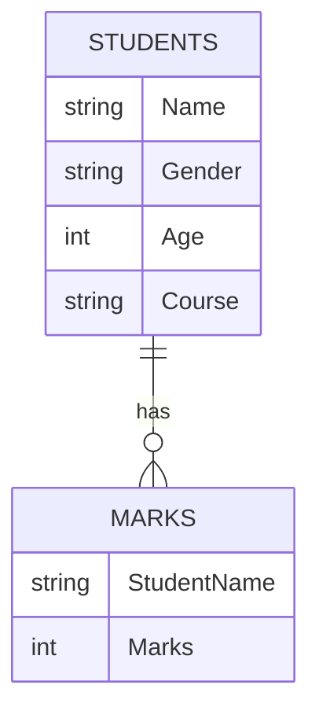
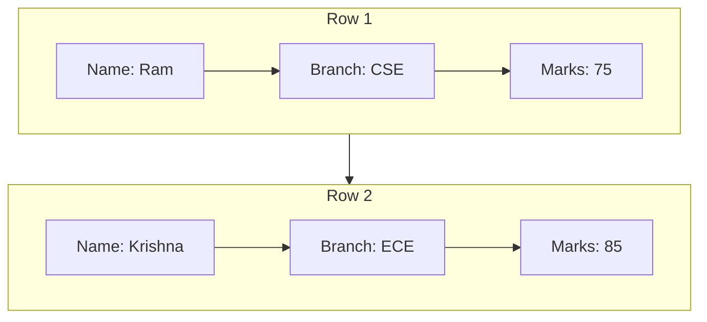
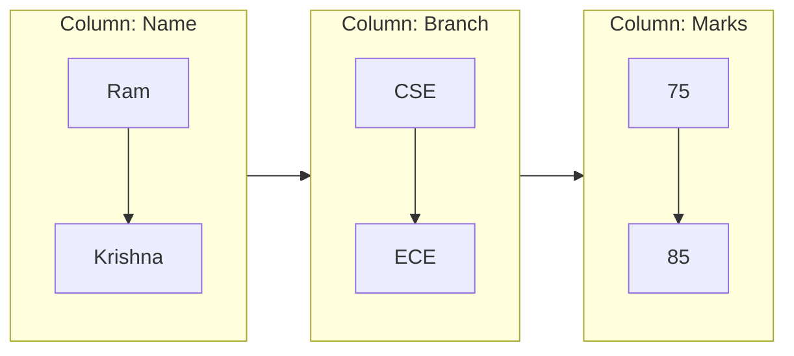
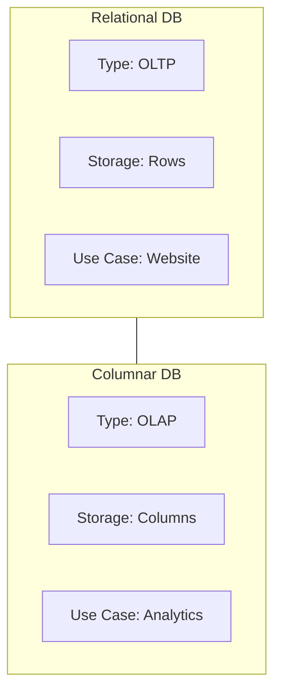

# Types of Databases

### 1. Relational Databases (SQL Databases)

* Store data in **tables (rows and columns)**.
* Tables can be linked using **relationships**.

Examples: **MySQL, PostgreSQL, Oracle, Microsoft SQL Server**

---

### 2. NoSQL Databases

* Handle large amounts of **unstructured or semi-structured data** (documents, images, videos).
* Example: **MongoDB**.

---

### 3. Columnar Databases

* Store data **by columns instead of rows**, making them efficient for analytics and aggregations (e.g., calculating averages).
* Examples: **Amazon Redshift, Google BigQuery**.

make them well sutied for data warehousing or analyatical applications 

#### store in memory 
 Take a sample table how it stored in row database and column database

| Name              | Branch   | marks |
| :---------------- | :------: | ----: |
| Ram               |   cse    | 75    |
| krisna            |   ece    | 85    |
| ...               |  ...     | ...   |

##### row database

##### column  database
Example in column database How it stored in memroy 

Example when you given calcualte the mean 
tho relational databse har raw ko memory ko load karega fir usma sa marks column ka mena leag
lakin wahi apka column database har ek column ka data memory ma load karega fir uska mean calcuate karega . this is memroy efficntent and faster . 
make a block of database 

---

### 4. Graph Databases

* Store **nodes and edges** for relationships (social networks, knowledge graphs).
* Examples: **Neo4j, Amazon Neptune**.

---

### 5. Key-Value Databases

* Store data as **key-value pairs** (useful for caching and quick lookups).
* Examples: **Redis, Amazon DynamoDB**.

---

### Which Database to Learn as a Data Scientist?

Priority:

1. **Relational Databases (SQL)**
2. **Columnar Databases** (for analytics)
3. **Basic NoSQL knowledge**

---

# Relational Databases (SQL Databases)

* Based on the **relational model**.
* Data is stored in **tables** (relations).

### Common Terminology

* **Table = Relation**
* **Column = Attribute**
* **Row = Tuple**
* **Number of Columns = Cardinality**
* **Number of Rows = Degree**
* **Domain = The allowed set of values for a column**

---

