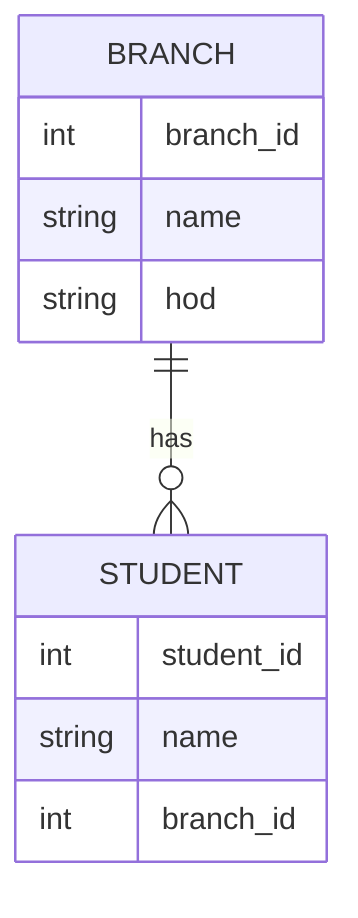
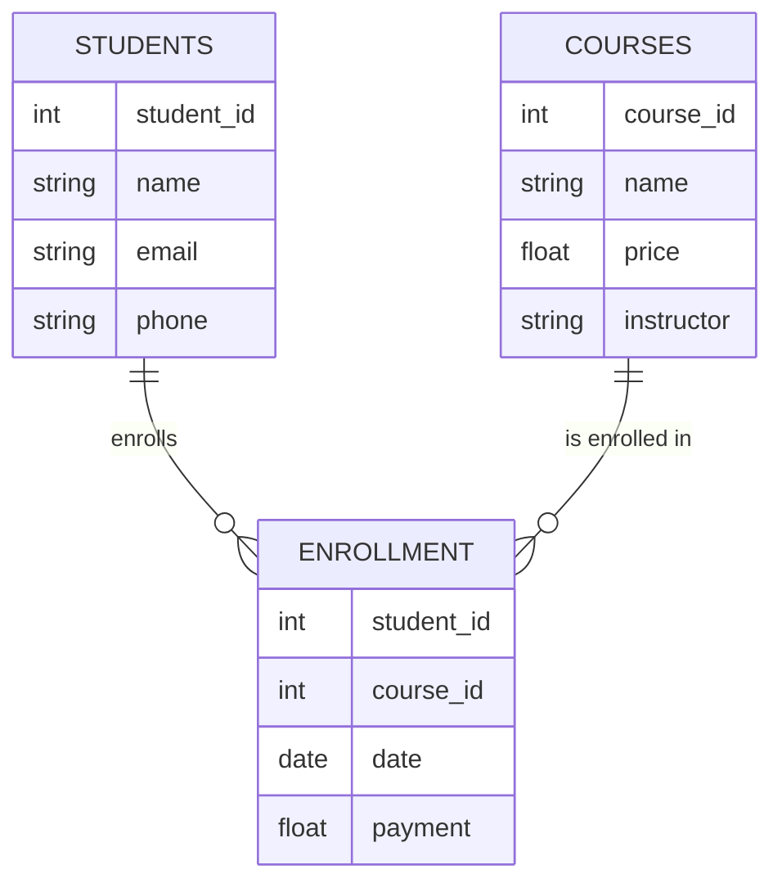

Deko rdbms ma hum table banta ha aor wo tables apas ma connected hota ha .
Question : Un Relationship ka type kiya ho sakta ha . 

entity is something jiska aap table bana sakta ho .some  real world things like students,employers,nature,biology,finance

Two tables ha unka bitch ek relationship ka . unka nature of relationship ko hum cardinaltiy sa bata sakta ha  

Cardinality in database relationships refers to the number of occurances of an entity in a relationship with another entity .        
Cardinality defines the number of instances of one enity that can be associated with a single instance of the related entity . 

![[Pasted image 20250808181913.png]]

## 3 types of relanship possible 
- one to one relationship
- one to many relationship
- many to many relationship 

### one to one
A person and a driving liciene

ek person ka ek driving license 
aor ek driving license ka correponding ek person hoga 
you need 1 table

name ,driving licene

### one to many 
studnet and colleage branch 

har student ek hi branch ma ho sakta ha 
lakin iska ulta true nahi ha
lakin ek branch ma many students ho sakta ha 

branch                              student
branch id,name ,hod           student id,name ,branch id

so branch table branch id is primary key 
in students branch id is foreign key

you need 2 table 
### many to many 

students and courses in udemny 

one student can enroll in multiple course like python,sql,statics,
iska ulta bhi true , ek course ma many student ho sakta python course have many student ,sql course have many students 

one student have many courses 
one courses have many students 

student                 courses 

        enrollemnt 

you need 3 table to store

summary 

relationship  and number of tables needed 
one to one        1
one to many       2
many to many      3

whenver you design a database apko ya model follow karna hoga .
agar apna nahi kiya tho baad ma gadbad hogi . so its is like a rule 