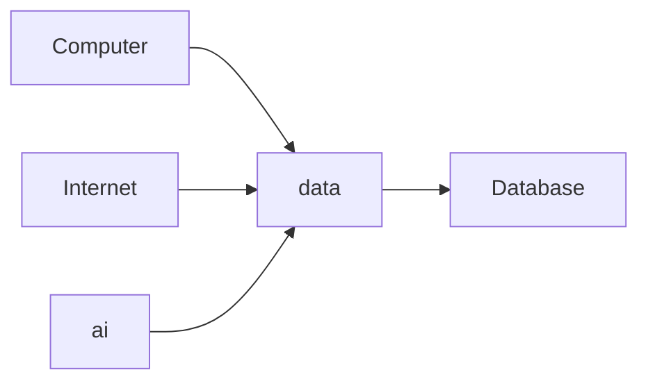
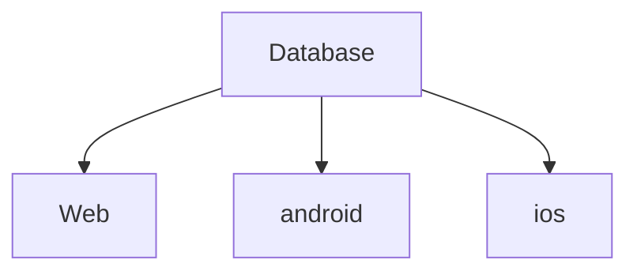
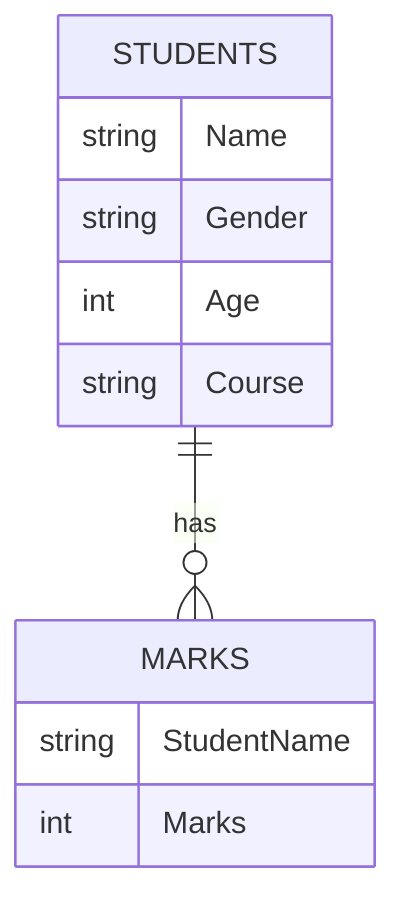
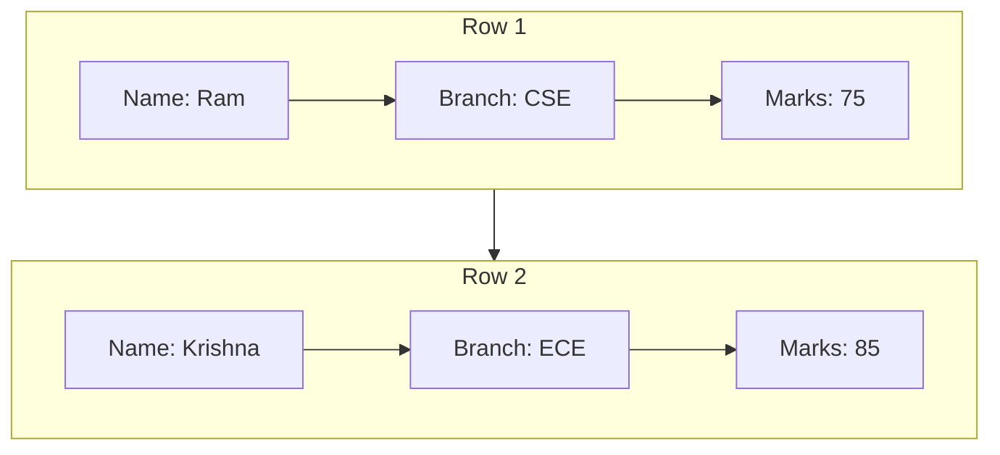
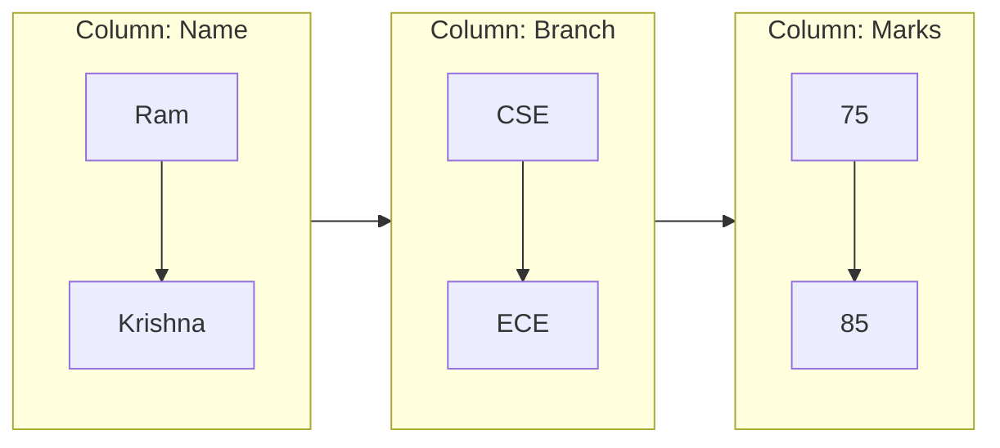
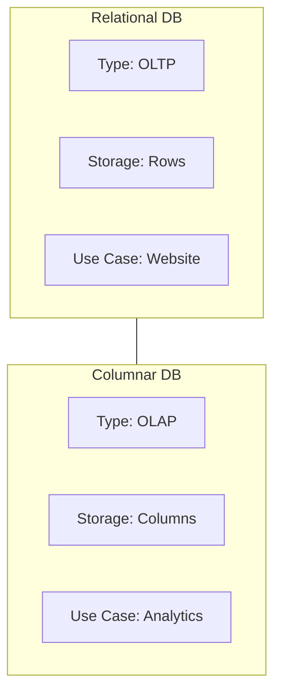
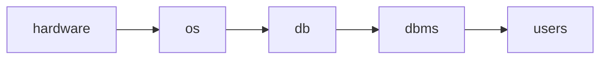

# Our learning journey
We learn python -> numpy-> pandas-> data viz-> Data Analysis 

Now we learn about Sql module in our journey
Sql is so importance for software enginering 
as welll as data Science

people do a mistake that just start learning sql so sql stands for stured query Lanuaguage . 
which is lanuage to talk communication to databases . 
your first goal is to learn about databess .
whenver you have idea of databases . you understand the sql better . 

Before learning sql their is one class dedicated for databases . 
Benefit of leanring it  when,where and how to apply sql queries . 
sql is easy but advanced level sql queris are little bit difficult . 
most of time if you pratice then sql is in your control . 
The main things in sql which help you is pratice . do more casestudies you see many problem see many unique example and see the gernal pattern among it you better  understand it.

We study sql from the Data analyastics perspective . 

how can we fill missing values
apply statics and analyise it.

3 points
1. Before study sql learn database
2. pratice is very important otherwise you furusted every time . 
3. we study sql form data analystics for 1 month.

# Importance of Data
why study data . 
because we are living in 
people say that data is new oil in the industry . 
But Why they say it . 
Observe it
 those people became rich who have data .

Notice : Big companies like google,facebook,microsoft,amazon . 
you use their product but they don't charge a single money for it. 
Example = google search did not charge money
facebook you post photos video they dont charge money .
Because they know that if they takes a little money from you . 
they will not able to erarn as much money as they earn but takes you data .

## histoic perspective of business 
so if you see in human history . buiness and socities grow in major events
Major revolution in human history
- agriculture
- inudstrial
    - mechical
    - electricicity
    - electronics
- Information
    - computers
    - internet
    - ai

In information revolution 
due to devlopment of physics,semicondcutor,transitor,microporcessors and we make power computer

computer era = business who have computer they store large number of data and process it and you have a competative advantage in buiness
internet era = suddenly all computers are connected and boom . 
who business came fast on internet gro fast example wallmart have offine stores but amozon came on internet first . it became the giant empire of business
Third in which we live is ai era 

Question : you can learn in history how buiness ,industry,socitey changes in era how they grow and fall . reason behind it and learn the principles and apply in the ai era . 
Question : what is the common thing in all era . 

all have comman is data . 
and where the data is stored .
it is stored in database . 
and how can you communicate with database 
you have to learn the sql .

so each company like to hire who people know about data . 
This is the big picture of it. 
That why their is demand for programerrs,data analyst ,data scientist who know about sql 

# What are database 

Technial Definitation : A Database is a Shared collection of logicaly related data description of theses data designed to meet the information need of an organization 

Conceputal definition :
A database  is a system
`which organise and store the information (data)`
you organise your information, knowldge,data in a structued form .
`jab bhi aap chaho jis form ma chao us form ma data ko retrive kar sakta ho `
you can retrive and represent data whenver you wan tin whatever form you want

So 
input : you have knowldge,information,data

process : you do
organises = classfiction and structure
store  = store in the memomry
retrive =  whenver you need you extract your stored data . 
represent  = you reprsent the data in many forms  example linear rows and columns you make many graph pie chart,line chart and many more.
you do non-linear . you see the graph view in data . nodes and edges  in it. 

## usecase and application of data 

`Data Storage`
: A database is used to store large amount of Structed data make it easily accessible ,searable and retrievable 
Example = their is a customer book an ola cap . so 3 days later he want to check its trip . How can it check . the ola apps store the customer profile and trip so they easily show it 
In general : you create a lot of data and the data is stored somewhere in database.
you can access the data whenver you need it.

`Data Analysis`: A database is used to perform analyatics, summarise ,describe ,data viz and generate reports so it provide insights and help in decesion making and understanging of system .
Example : user genrate a lots  of data activites behaviour by data. you ask question and give answers .
how much buy came ,buy and sell 
 How much sales happen in year
 why company have loss what is the reason for it. 
By seeing data you make solutions 
That why lots of data related role . 
So they takes a partcilar domain take the database . observe it ,identify problem and tell the solution . that why lots of organisation are take decesion based on data rather than inution 

`Record keeping` : A database is used to keep track of importansts records example financial transation,customer information and inventary levels.

`Web Application and Mobile Application` :
Database is essential compentn of many web application provide dyanmic content and user management .
Example : aap ek user ko login karna ha ,
ara deko mena past ma register kiya tha,mera information dek kar deko vo match karta ha ki nahi

Search karna user,profile dekana ,
recommendation sytem

##  CRUD
look at any simmple and complex software and application on mobile or web 
you can do  four fundamental operation
any database.
`Create` = create the data
`Read` = read retrive access the data
`Update` = you update the data 
`Delete` = delete the data 

#### account example
you create the user account registration
you read the user account login email and passoword 
you update the passowrd of the user.
you delete the accout

#### text example
you are creating a new note in the notebook
you are reading the text in the notebook
you are edting your notes in the notebbok
you are delte erasing with eraser. 

#### photo example
you creata a photo by clicking it
you read it access the phot in the gallery
you update it add filter,rotate, it
you delete the photo.

#### video example
you create a video by shooting it
you read the video file watching a movie
you update it you editing on video,trim it
you delte the video file

final : you take any web or mobile appliation software system. 
the operation are classified into 4 fundamentals are create,read,update,delte

# 5 properites of ideal database

1. Integrity = accurate + conistency
2. Availability
3. Security
4. Indepdence of application 
5. Concurreny

Expalantion
integrity = accurate + conistency
matalb apka database accurate hona chaya asa nahi ki hama store ki values baad ma vo galat dika raha heights ko store kiya postive negative dika raha  aor conistency = humesa vo sahi information display raha yadi user ka name krishna ha tho hamersa krishna display karo
accuraty + consisetncy = satya ho aor sada  ho
avaialbitliy = yani 24 * 7 . vo down nahi hona chaya.
security = deko financial data government company personal data . tho dabase apka secure rena chay
indepdence of application = yadi yadi facebook of data ha asa nahi mobile ka liya alaga,web ka liya alga 

Concurrency = serial wise nahi pararell hona chaya ek sath million of users ko vo request da paya

# Types of Databases

## relational database
also know as SQL databases you store tabular data
Databases uses the relational model to 
organise data into tables with rows and columns 

Every database have tables . 
each table is connected to other tables.
each table have have values which are connected by row and columns 

Examples : Mysql,postgre,oracle,microsoft sqlserver

## NoSQL Databases 
This databases are designed to handle large amount of unstructed or semi-structed data such as document ,images, videos,audio

example : MongoDB

## Column Databases
relational databses are row based databases.
because you store every values in row
             name  gender age course
student 1
studetn 2 
... n

coloumn databases are store in a column rathers then row . 
make them well sutied for data warehousing or analyatical applications 
Example (Amazon redshift ,google bigquery)

| Name              | Branch   | marks |
| :---------------- | :------: | ----: |
| Ram               |   cse    | 75    |
| krisna            |   ece    | 85    |
| ...               |  ...     | ...   |

### row database

Example when you given calcualte the mean 
tho relational databse har raw ko memory ko load karega fir usma sa marks column ka mena leag
lakin wahi apka column database har ek column ka data memory ma load karega fir uska mean calcuate karega . this is memroy efficntent and faster . 
make a block of database 

Deko Website ka data directly dena risky ho sakta ha isliya apko columnn db banta ha jikso data wareshoue hota ha

## Graph database
These databases are used to store and query graph stuctured data . example knowldge mangement,social network conneciton ,recommendation system 
example (neo.4j ,amazon neptune)
usecase : facebook,twitter,linkdelin ,instagram ,obsidian,dendroid

## key-value database
These databases store data as a collection of keys and values pair , making weill suited for caching and simple data storage needs

example (redis and amazon dyanmoDB)
jab bhi apka chota chota information store karna hota ha deko twitter ki website ha wha par tweets = 2k ha and followers. = 2M 
deko jada user login karega profile par aap esa thod hoga  database ma loop chealegaa vo shuru sa sara tweets or follower count karega. aap ya two information number of tweets and number of follower ko phala sa hi calcualte karega rako . tho ek web application ma bhut sa aggreate operation ho jo pahal sa calcuate ho . esa caching bolta ha . aap isko baar baar calcuate nahi karna chata . 

## Which database should be use 
so iska koi fixed answer nahi ha . applcication ,usecase ,requiremnt ka hisab sa decide hota ha .
konsa database use kara kaha par
That is possible ki aap single application ma multiple databse run kar raha ho 
a complex website have multiple databases and powering them . 
Question : As a Data Scientist which database type is important for you 
the priority order is 
1. Relational db
2. coloumn db
thoda sa apko 
3. no sql 
ki bhi jankari honi chaya

So now we focus on Relation database
# Relational Databases .
also knows as SQL database . it is based on relational model where store and organise data in tables with rows and columns

Termonlogy in relational database
Table ka matlab relation 

coummns = atributes
row = tuples 
number of coloumns = cardanlaity
number of rows = degree
Domain = particular column ma kis type ki values ko daal sakta ho  .itana ma sa kuch values ko aap isma daal sakta ho 

## DBMS
A database management system (DBMS) is a software system . that provide interface ,tools need to store ,organise and mange data in a databse. 

A DBMS like a intermediate communication between  user ,application  or database.

deko when people say data jo ha database ma store . 
acutally database operating system sa bhat karta fir apka operating system hardare yani memory sa bhat karta ha hdd,sdd, 
deko apka paas data ha wo kahi tho memory level par store hoga . 

## functions of DBMS

- Data Mangement = crud opration 
- integrity = maitain acruacy of data
- concurrency = simultaneous data access for multiple users .
- Trf