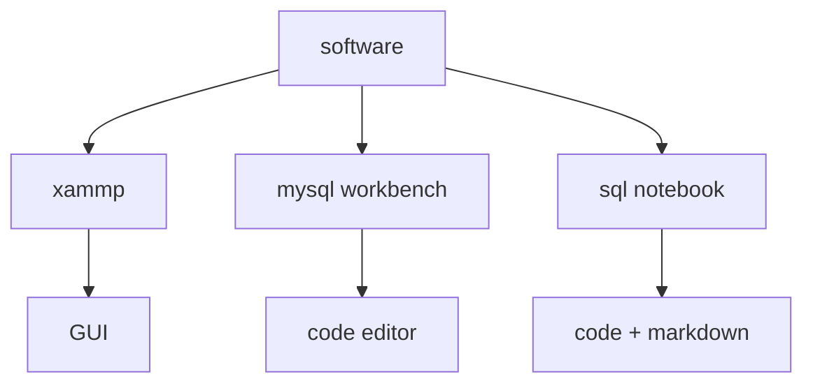
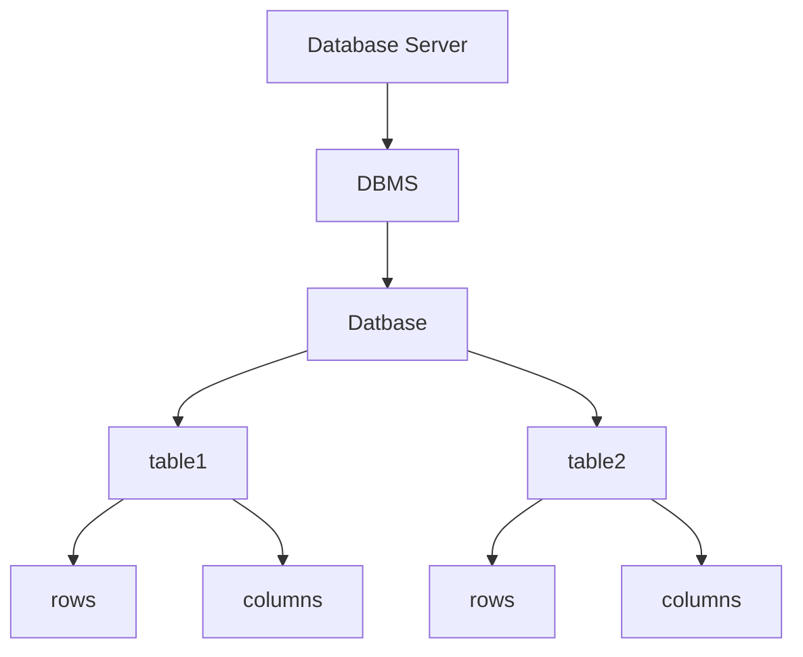

In that course we use the 3 softwares 

Today session is on xampp because we do a lot of GUI things 

you have to remember the hierarchy of databases isko hum bolta ha relationships database model

