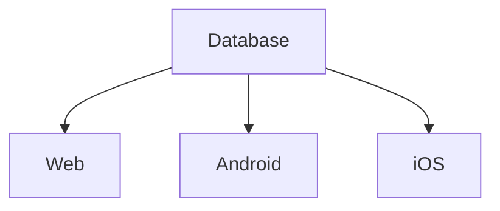

# What is a Database?

### Technical Definition

A **Database** is a **shared collection of logically related data and its description**, designed to meet the information needs of an organization.

### Conceptual Definition

A **Database** is a **system that organizes, stores, retrieves, and represents data in a structured way**.
In simple terms:
You can store information and later retrieve it **in any form you want** (tables, charts, reports, etc.).

---

### How It Works (Input → Process → Output)

1. **Input**: Knowledge, information, raw data.
2. **Process**:

   * **Organize** (classify and structure data)
   * **Store** (in memory – HDD, SSD, or cloud)
   * **Retrieve** (fetch when needed)
   * **Represent** (tables, charts, graphs, or network views)
3. **Output**: Insights, reports, visualizations, or application data.

---

# Properties of an Ideal Database (5 Qualities)

1. **Integrity** = Accuracy + Consistency

   * Data must be correct (e.g., height stored as a positive value).
   * It must always be consistent (a user named Krishna must always appear as Krishna).

2. **Availability**

   * Must be available 24×7 without downtime.

3. **Security**

   * Protect sensitive data (finance, government, personal).

4. **Independence of Application**

   * One database can serve multiple platforms (web, iOS, Android).

5. **Concurrency**

   * Must handle millions of users simultaneously (not one at a time).

---

