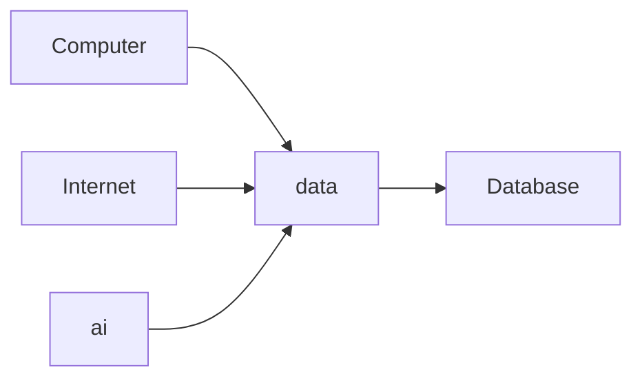

### Why Is Data Important?
We live in an age where people say,
> “ Data is the new oil. ”

But why?

The richest companies today – Google, Facebook, Microsoft, Amazon – earn billions not by selling products directly but by collecting and using data.

Example: Google Search is free, Facebook doesn’t charge for posting photos, but they monetize your data.
Historical Perspective of Business and Technology
In human history, societies and industries grew through major revolutions:

## histroic perspective of business 
so if you see in human history . buiness and socities grow in major events
Major revolution in human history
- agriculture
- inudstrial
    - mechical
    - electricicity
    - electronics
- Information
    - computers
    - internet
    - ai

In information revolution 
due to devlopment of physics,semicondcutor,transitor,microporcessors and we make power computer

computer era = business who have computer they store large number of data and process it and you have a competative advantage in buiness
internet era = suddenly all computers are connected and boom . 
who business came fast on internet gro fast example wallmart have offine stores but amozon came on internet first . it became the giant empire of business
Third in which we live is ai era 

- Question : you can learn in history how buiness ,industry,socitey changes in era how they grow and fall . reason behind it and learn the principles and apply in the ai era . 
- Question : what is the common thing in all information era . 

all have comman is `data` . 
- Data is stored in databases.
- To communicate with databases, we must learn SQL.
- This is why SQL skills are demanded by programmers, data analysts, and data scientists.

This is the big picture of it. 

